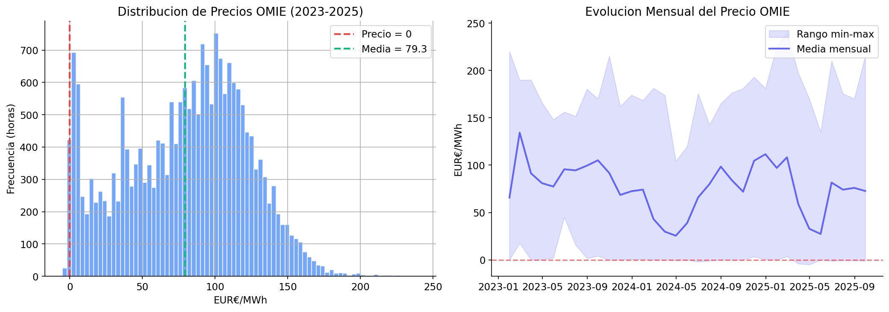
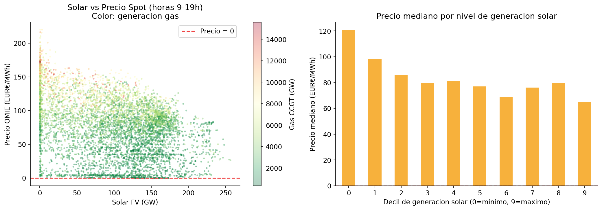
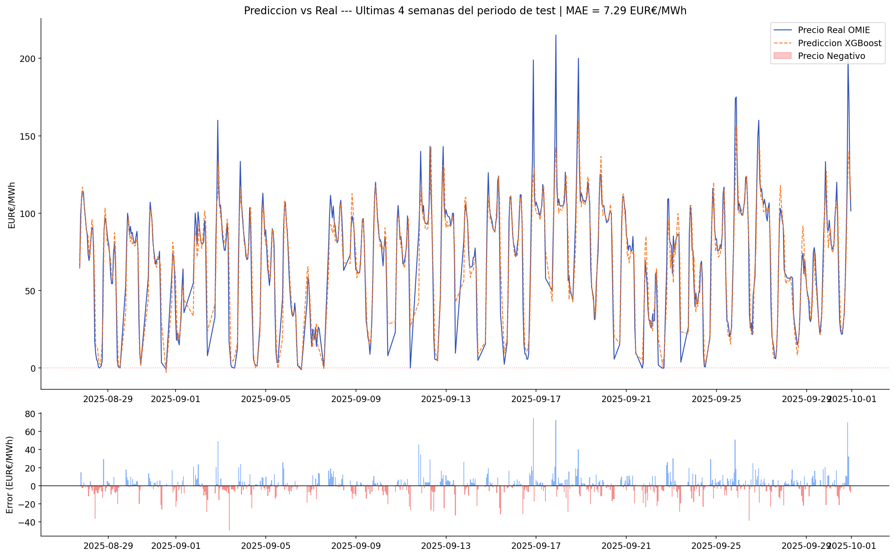
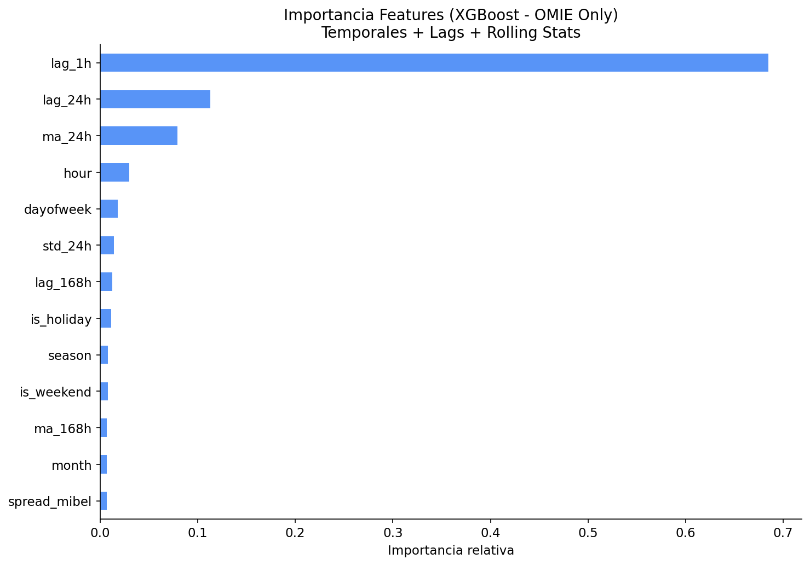

# OMIE Spot Price Analysis — Spanish Electricity Market

> Análisis de precios horarios del mercado diario español (2023–2025): exploración, modelado predictivo y análisis de eventos extremos.

[](https://python.org)
[](https://xgboost.readthedocs.io)
[](LICENSE)

---

## Descripción

Pipeline completo sobre el mercado eléctrico spot español, desde la ingesta de datos crudos hasta el modelo de predicción de precio Day-Ahead (D+1). El proyecto combina:

- **Datos propios de mercado** descargados directamente desde OMIE (Operador del Mercado Ibérico de Energía).
- **Contexto físico del sistema eléctrico** a través de la API de Red Eléctrica de España (ESIOS/REE): generación real por tecnología y demanda prevista.
- **Modelado predictivo** con XGBoost Gradient Boosting, con énfasis en rigor metodológico (sin data leakage) y comparativa contra baseline de persistencia.
- **Análisis de eventos extremos**: precios negativos, curtailment solar y comportamiento del modelo en distintos regímenes de precio.

---

## 📊 Resultados Finales

| Modelo | MAE (€/MWh) | RMSE (€/MWh) | Mejora |
|--------|------------|------------|---------|
| **Baseline** — persistencia lag-24h | 18.33 | 26.90 | — |
| **XGBoost** — features + ESIOS | **6.91** | **10.60** | **62.3%** ↓ |

**Dataset**: 2023–2025 (24,096 horas totales)  
**Train**: ~19,000 horas (2023-01-08 → 2025-06-30)  
**Test**: ~5,000 horas (2025-07-01 → 2025-09-30) — temporal split, sin data leakage  
**Validación**: Coherencia energética verificada ✅ (suma componentes = total, diferencia 0%)

---

## 📁 Estructura del Proyecto

```
omie-spot-analysis/
├── 📔 notebooks/                          [Análisis interactivos — ejecutar en orden]
│   ├── 00_setup.ipynb                     Validación de environment y datos
│   ├── 01_data_extraction.ipynb           Ingesta OMIE + ESIOS, mix generación
│   ├── 02_eda.ipynb                       Exploración, distribuciones, correlaciones
│   ├── 03_forecasting.ipynb               XGBoost D+1 (MAE 6.91, RMSE 10.6)
│   └── 04_advanced_analysis.ipynb         Análisis extremos, solar vs precio
│
├── 🔧 src/                                [Módulos reutilizables]
│   ├── load_data.py                       Parser OMIE (.txt) → dataframe
│   ├── features.py                        Feature engineering (lags, ESIOS)
│   ├── esios_client.py                    API REE con caché local
│   └── omie_downloader.py                 Descarga automática desde portal OMIE
│
├── 📊 data/                               [Datos — no en git]
│   ├── raw/2023-2025/                     Ficheros OMIE descargados (.txt)
│   └── processed/                         Datasets procesados (.parquet)
│       ├── omie_precios.parquet           Precios spot 2023–2025
│       └── esios/                         Features ESIOS derivadas (API REE)
│
├── 📈 reports/figures/                    [Visualizaciones estáticas]
│   ├── feature_importance.png             Lags > calendar > renewable %
│   ├── price_distribution.png             128h de precio negativo
│   └── prediction_vs_real.png             Test period: MAE 6.91 €/MWh
│
├── 🌐 docs/                               [Dashboard interactivo & JSON]
│   └── index.html                         Plotly.js visualizaciones
│
├── 📋 README.md                           [Documentación pública — ESTE FICHERO]
├── 📝 PROJECT_MEMORY.md                   Notas técnicas internas (usuario)
├── 🔐 requirements.txt                    Dependencias Python
└── setup_data.py                          Setup simplificado
```

---

## 🚀 Quick Start

### Opción 1: Demostración rápida (~2 minutos)

```bash
# Datos ya procesados incluidos en /data/processed/
jupyter notebook notebooks/01_data_extraction.ipynb  # Revisión de datos
jupyter notebook notebooks/03_forecasting.ipynb      # Ver el modelo
```

### Opción 2: Ejecución completa end-to-end (~5 minutos)

```bash
# 1. Clonar + instalar
git clone https://github.com/aibanezdelacruz-tech/omie-spot-analysis.git
cd omie-spot-analysis
pip install -r requirements.txt

# 2. Opcional: Descargar datos OMIE frescos
python src/omie_downloader.py --start 2023-01-01 --end 2025-12-31

# 3. Regenerar features ESIOS (requiere token personal)
# Ver sección "ESIOS API Token" abajo

# 4. Ejecutar análisis
python run_all_notebooks.py
# O manualmente:
jupyter notebook
# Luego ejecuta: 00_setup → 01_data → 02_eda → 03_forecasting → 04_advanced
```

### ⚠️ ESIOS API Token

REE proporciona acceso gratuito a la API ESIOS para uso personal/académico:

```bash
# 1. Solicitar token
   Email: consultasios@ree.es
   Asunto: Token ESIOS API request (personal use)
   Esperar: 2–5 días hábiles

# 2. Configurar
   echo "ESIOS_API_KEY=your_token_here" > .env

# 3. Usar en código
   from src.esios_client import ESIOSClient
   client = ESIOSClient()  # Carga token desde .env
```

**Nota**: Si publicas este código, cada usuario debe usar su propio token (REE no permite compartir tokens)

---

## Metodología

### Fuentes de datos

**OMIE** publica el fichero `marginalpdbc_YYYYMMDD.txt` diariamente con el precio horario de casación del mercado spot (España y Portugal). El proyecto descarga y parsea estos ficheros desde 2023 hasta septiembre 2025, resultando en ~24,000 horas de datos horarios de precio.

**ESIOS (REE)** proporciona datos en tiempo real del sistema eléctrico peninsular: generación por tecnología, demanda prevista, interconexiones. La API tiene rate limiting; el cliente implementado gestiona delays automáticos y un sistema de caché local en Parquet para evitar descargas redundantes.

### Feature Engineering

Las variables del modelo se dividen en tres grupos:

**Temporales y de calendario** — codifican el comportamiento estructural de la demanda:

| Feature | Justificación |
|---------|--------------|
| `hour` | La curva de consumo tiene forma de ola predecible (valle nocturno, rampa mañana, solar valley mediodía, pico vespertino) |
| `dayofweek`, `is_weekend` | El consumo industrial colapsa en fin de semana; el patrón de precios cambia significativamente |
| `month`, `season` | Estacionalidad térmica (verano) e hidráulica (primavera) |
| `is_holiday` | Los festivos replican el patrón de domingo con mayor exactitud que un simple flag de día de semana |

**Autoregresivas (lags)** — el precio spot tiene fuerte autocorrelación temporal:

| Feature | Lag | Captura |
|---------|-----|---------|
| `lag_1h` | –1h | Autocorrelación de muy corto plazo |
| `lag_24h` | –24h | Ciclo diario; es también el modelo de **Baseline** |
| `lag_168h` | –7 días | Ciclo semanal laborable/festivo |
| `ma_24h`, `std_24h` | rolling 24h | Nivel de mercado reciente y volatilidad |
| `ma_168h` | rolling 7d | Tendencia semanal |

**Físicas ESIOS (exógenas)** — capturan el estado del sistema eléctrico y el merit order:

| Feature | Relación con precio |
|---------|-------------------|
| `solar_fv`, `eolica` | Inversa: más renovable desplaza al gas y deprime el precio |
| `nuclear` | Inversa: baseload constante; su fallo eleva el precio |
| `gas_ccgt` | Directa: cuando el gas es el marginal, el precio refleja su coste |
| `hidraulica` | Inversa: disponibilidad hidráulica sustituye al gas |
| `pct_renovable` | Inversa: métrica resumen del efecto depresor del mix renovable |
| `demanda_prev` | Directa: mayor demanda → más gas necesario → precio más alto |

### Gestión de datos faltantes en ESIOS

Los indicadores `gas_ccgt` e `hidraulica` presentan cobertura más fragmentada en 2023 en la API de ESIOS. Un `dropna()` estricto habría eliminado ~17,000 horas del conjunto de entrenamiento, dejando menos de un año de datos —insuficiente para capturar la estacionalidad completa del mercado.

Se aplica interpolación temporal con límite de una semana para rellenar los gaps, seguida de backfill para los NaN al inicio del período. Esta técnica es físicamente coherente: la generación de gas varía de forma gradual. Los gaps superiores a 7 días no se interpolan y se descartan. El resultado es un aumento del conjunto de entrenamiento de 6,605 a **18,920 horas** (+186%).

### Protocolo de validación

El mercado eléctrico es una serie temporal: mezclar aleatoriamente muestras de distintas fechas introduce **data leakage** (el modelo aprendería del futuro). Se usa un split temporal estricto:

- **Train**: 80% inicial del dataset (2023-01-08 hasta ~marzo 2025)
- **Test**: 20% final, **nunca** visto durante el entrenamiento
- **Baseline**: precio de "persistencia" — asumir que mañana el precio es igual que hoy a la misma hora (`lag_24h`). Si el modelo no supera este naive predictor, no aporta valor.

### Modelo — XGBoost Gradient Boosting

XGBoost construye árboles de decisión secuencialmente, donde cada árbol corrige los errores residuales del anterior. Ventajas específicas para este problema: maneja features mixtas sin escalado, captura interacciones no lineales entre variables físicas, y ofrece importancia de variables interpretable.

---

## Visualizaciones

### Distribución de precios y eventos extremos (2023–2025)


> 128 horas de precio negativo concentradas en mediodías de primavera, consecuencia del exceso de generación fotovoltaica sobre la demanda (curtailment). Mínimo histórico: −5 €€/MWh.

### Relación generación solar vs precio spot


> La correlación inversa entre generación solar y precio spot es la expresión empírica del merit order: la fotovoltaica (coste marginal ≈ 0) desplaza a los ciclos combinados de gas.

### Predicción vs Real — últimas 4 semanas del test


> MAE global: **7.91 €€/MWh** (−61% respecto al baseline de persistencia). El modelo captura correctamente los picos vespertinos y los eventos de precio negativo al mediodía.

### Importancia de variables — XGBoost ESIOS Enriched


> El `lag_1h` domina por la fuerte autocorrelación de la serie. Entre las variables físicas, `solar_fv` e `hidraulica` tienen mayor contribución que `gas_ccgt`, lo que refleja el impacto del crecimiento renovable sobre la formación del precio en el período 2023–2025.

---

## Contexto del mercado

El mercado diario gestionado por OMIE opera mediante un sistema de **casación marginalista**: el precio de equilibrio lo fija la oferta más cara necesaria para cubrir la demanda ("precio marginalista"). En España, esta tecnología es el ciclo combinado de gas natural en la mayoría de las horas.

El merit order resultante (de coste marginal más bajo a más alto):
1. Eólica y solar fotovoltaica — coste marginal ≈ 0 €€/MWh
2. Nuclear — carga base, sin flexibilidad
3. Hidráulica — flexible según disponibilidad de embalses
4. Gas natural (CCGT) — precio formado por gas TTF + derechos de CO₂
5. Carbón y otros térmicos — residual en España

El período 2023–2025 presenta una dinámica novedosa: la penetración masiva de fotovoltaica ha introducido el fenómeno de **precios negativos** en horas solares de alta producción y baja demanda, alterando los patrones históricos de precio que los modelos entrenados con datos anteriores anticipaban mal.

---

## Autor

**Alejandro Ibáñez de la Cruz**  
Ingeniero Eléctrico · Data Scientist — Mercados Energéticos

- [LinkedIn](https://linkedin.com/in/aibanezdelacruz)
- [Portfolio](https://aibanezdelacruz-tech.github.io/energy-portfolio/)

---

## Licencia

MIT License — libre uso con atribución.
